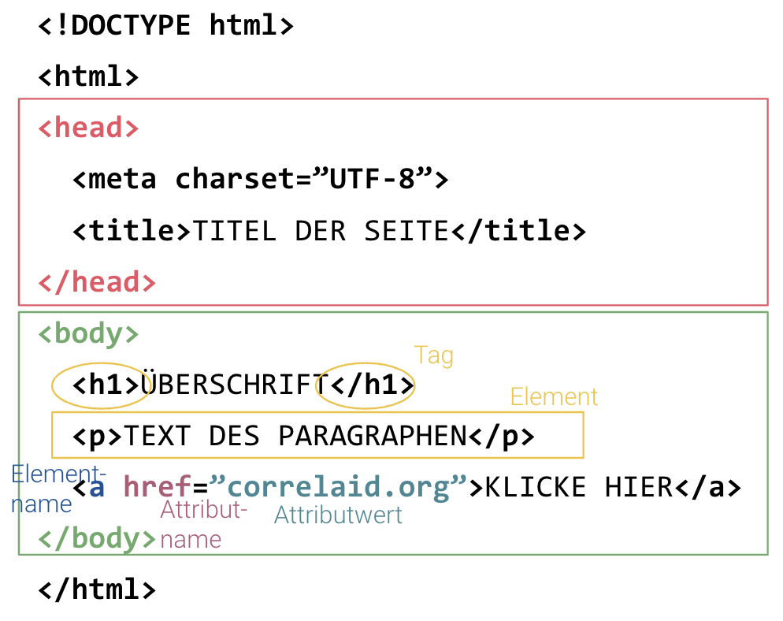
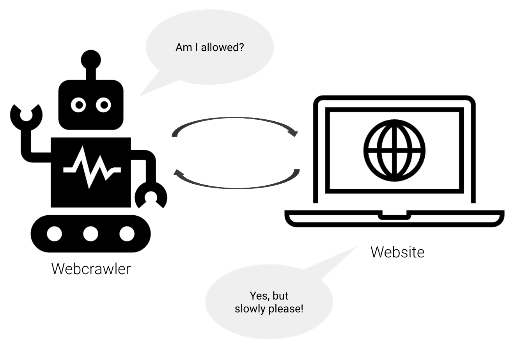
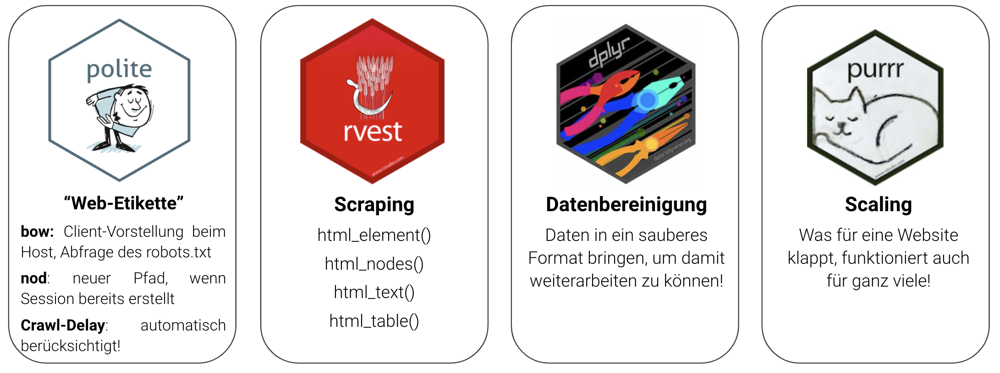

```{r setup, include=FALSE}
knitr::opts_chunk$set(echo = TRUE)
library(dplyr)
library(knitr)
library(forcats)
library(countrycode)
library(tidyr)
library(ggplot2)
```

# Introduction

## Outline
- Understanding the structure of **HTMLs**
- Extracting information based on its **XPaths**
- **"Web etiquette"** & the robots.txt
- **Hands-On**: Scraping a Website

# Before we start - Setup

## Setup & Installation
- You need to have R and RStudio installed!
- Please download or clone the repository: `https://github.com/ZoeWolter/workshop-webscraping/`
- Please install the packages via this code: 

```{r, eval = FALSE}
source(knitr::purl('code/packages.Rmd', quiet = TRUE))
```

# Some theory | Web Data Collection

## Why?

## Why?
<blockquote>
**Web Scraping** = collection of information from websites by extracting code directly from the html code
</blockquote>

- Daten über Daten
- kein Copy&Paste mehr
- Automatisierung der Datensammlung
- reproduzierbare und aktualisierbare Datensammlung

## What are websites built of?

## What are websites built of?

{width=80%}

## HTML (1)

- **H**ypertext **M**arkup **L**anguage
- Instructions to the bwoser what to **display** when and where
- for web scraping: we don't need to write HTML, but understanding helps a lot!
- hierarchical tree structure
- tags with attributes

## HTML (2)

{width=60% height=100%}

## HTML (2)

| Tag                               | Description                    |
|-----------------------------------|--------------------------------|
| `<a href=""></a>`                 | Link / URL                     |
| `<div>` and `<span>`              | Blocks to structure the page   |
| `<p></p>`                         | Paragraph                      |
| `<h1>`, `<h2>`,...                | Headers                        |
| `<ul>`, `<ol>`, `<dl>`            | Lists                          |
| `<li></li>`                       | Single list element            |
| `<br>`                            | Line break                     |
| `<b>`, `<i>`, `<strong>`          | Layout options                 |
| `<table>`, `<th>`, `<td>`, `<tr>` | Tables                         |
| `<script></script>`               | Script container               |

## XPath
- **X**ML **Path** Language
- **query language** to extract parts of HTML/XML-files
- use tags, attributes, and relations between **nodes** and tags
- based on **hierarchical structure** of nodes
- absolute paths: '/html/body/div/p'
- relative paths: '//p'

## robots.txt
- **Robots Exclusion Standard**
- message to (search engine) crawlers about the urls they are allowed to access
- goal: avoid a website to break down due to too many requests at once 
- definition of a **crawl-delay** (e.g. 5 sec)
<br>
{width=50%}

## Web Scraping in R - Packages 
{width=100%}

# Hands-On | Web Scraping Workflow in R

## Website

$\longrightarrow$ find the URL to the website you want to scrape

```{r, results = 'hide'}
base_url <- 'https://www.bertelsmann-stiftung.de/'
projects_url <- 'https://www.bertelsmann-stiftung.de/en/our-projects/project-search?page=1'
```

## Be polite! (1)

$\longrightarrow$ tell the website who you are!<br>
$\longrightarrow$ check whether you are allowed to scrape!<br>

```{r, results = 'hide'}
polite::bow(url = stringr::str_c(base_url), 
            user_agent = 'Workshop Web Data Collection - zoe.w@correlaid.org') -> session
```

```{r echo = FALSE}
session
```

## Be polite! (2)

```{r, results = 'hide'}
session
session$robotstxt
session$robotstxt$permissions
session$robotstxt$crawl_delay
```

$\longrightarrow$ Are we **allowed** to scrape? <br>
$\longrightarrow$ Which **crawl-delay** is set for this website? <br>
$\longrightarrow$ Are there any **rules** for some bots? <br>

## Download htmls (1)

1 - Load the html page (as list of `<head>` and `<body>`) in R:

```{r, results = 'hide'}
# call the session you created
session %>% 
  # be polite & specify url path
  polite::nod(stringr::str_c('en/our-projects/project-search?page=1')) %>%
  # scrape!
  polite::scrape() -> projects_html
```

## Download htmls (2)

2 - Best practice: download htmls and save them locally:

```{r, results = 'hide'}
# create directory to store the htmls
if (!dir.exists(here::here('assets', 'htmls'))) {
  dir.create(here::here('assets', 'htmls'))
}
# function to download htmls
download_html <- function(url, filename) {
  polite::nod(session, url) %>%
    polite::rip(destfile = filename,
                path = here::here('assets', 'htmls'),
                overwrite = TRUE)
  }
# call function to download html 
download_html(stringr::str_c(base_url, 'en/our-projects/project-search?page=1'),
              'projects.html')
```


## XPath: Extract data (1)
$\longrightarrow$ click right on the webpage $\rightarrow$ inspect $\rightarrow$  search for html node <br>
$\longrightarrow$ [Selector Gadget](https://selectorgadget.com/): "SelectorGadget is an open source tool that makes CSS selector generation and discovery on complicated sites a breeze" <br>
$\longrightarrow$ Can you find the XPath to the first project on the website?

## XPath: Extract data (2)
//*[@id="c199640"]/div[2]/div/div[2]/div[2]/div[2]/<br>
div/div/div[**1**]/article/div[2]/div/div[2]/h2/a <br>

//*[@id="c199640"]/div[2]/div/div[2]/div[2]/div[2]/<br>
div/div/div[**2**]/article/div[2]/div/div[2]/h2/a

Now extract the title of the first project:

```{r}
projects_html %>%
  rvest::html_element(xpath = '//*[@id="c199640"]/div[2]/div/div[2]/div[2]/div[2]/
                               div/div/div[1]/article/div[2]/div/div[2]/h2/a') %>% 
  rvest::html_text2()
```

## XPath: Extract data (3)

What else can we extract?

```{r}
# url to project
projects_html %>%
  rvest::html_element(xpath = '//*[@id="c199640"]/div[2]/div/div[2]/div[2]/div[2]/
                               div/div/div[1]/article/div[2]/div/div[2]/h2/a') %>% 
  rvest::html_attr('href')

# project description
projects_html %>%
  rvest::html_element(xpath = '//*[@id="c199640"]/div[2]/div/div[2]/div[2]/div[2]/
                               div/div/div[2]/article/div[2]/div/div[3]/div/p') %>% 
  rvest::html_text2()
```

## Data Cleaning

Before cleaning: we need a data frame!

```{r}
data.frame(
  project = projects_html %>% 
    rvest::html_nodes(xpath = '//*[@id="c199640"]/div[2]/div/div[2]/div[2]/div[2]/
                               div/div/div[*]/article/div[2]/div/div[2]/h2/a') %>%
    rvest::html_text2(),
  text = projects_html %>% 
    rvest::html_nodes(xpath = '//*[@id="c199640"]/div[2]/div/div[2]/div[2]/div[2]/
                               div/div/div[*]/article/div[2]/div/div[3]/div/p') %>%
    rvest::html_text2()
) -> df
```

## Store data

Since you don't want to run your scraping script each time you do some analysis:

```{r}
saveRDS(df, file = here::here('data', 'projects.RDS'))
```

# Scraping at Scale

## Sraping at Scale (1)

- https://www.bertelsmann-stiftung.de/en/our-projects/project-search?page=1
- https://www.bertelsmann-stiftung.de/en/our-projects/project-search?page=2

```{r}
# define base URL
base_url <- 'https://www.bertelsmann-stiftung.de/'

# Be polite
session <- polite::bow(url = base_url, 
                       user_agent = 'Workshop Web Data Collection - zoe.w@correlaid.org')

# Vektor to define all pages we want to have a look at
pages <- 1:7
```

## Sraping at Scale (2)

1 - Load ALL the html pages in R:

```{r}
# With purrr you can map over all numbers in the vector "pages"
purrr::map(.x = pages, ~ {
  #...you create the url for each of the pages...
  polite::nod(session, stringr::str_c('en/our-projects/project-search?page=', .x)) %>% 
  #...and scrape the htmls!
    polite::scrape() 
}) -> results   
```

## Sraping at Scale (3)

2 - Best practice: download htmls and save them locally:

```{r, results = 'hide'}
# With purrr you can map over all numbers in the vector "pages"
purrr::map(.x = pages, ~ {
  #...you create the url for each of the pages...
  polite::nod(session, stringr::str_c('en/our-projects/project-search?page=', .x)) %>% 
  #...and save!
    polite::rip(destfile = stringr::str_c('projects_', .x, '.html'),
                path = here::here('assets', 'htmls'),
                overwrite = TRUE)
})
```

## Scraping at Scale (4)

Create a data frame with ALL projects:

```{r}
purrr::map_dfr(.x = results, ~ {
  data.frame(
  project = .x %>% 
    rvest::html_nodes(xpath = '//*[@id="c199640"]/div[2]/div/div[2]/div[2]/div[2]/
                               div/div/div[*]/article/div[2]/div/div[2]/h2/a') %>%
    rvest::html_text2(),
  text = .x %>% 
    rvest::html_nodes(xpath = '//*[@id="c199640"]/div[2]/div/div[2]/div[2]/div[2]/
                               div/div/div[*]/article/div[2]/div/div[3]/div/p') %>%
    rvest::html_text2()
  )  
}) -> all_events
```

# Thank you! | Contact me via zoe.w@correlaid.org if you've any questions! 
